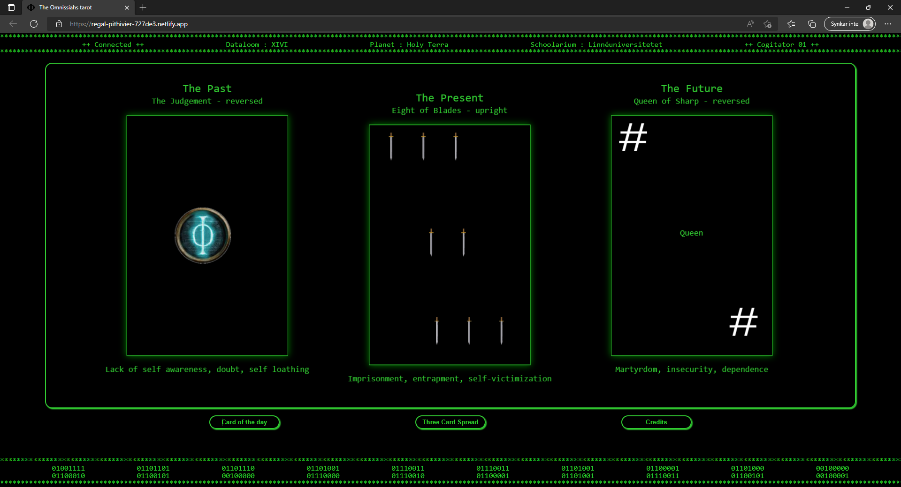

# the Omnissiah´s tarot - Browser edition

## a Training with using objects
As a practice with the use of objects in javascript I have written this terminal based tarotreader.

## Installation
- 1 Clone into a local folder using $ git clone
- 2 Run 'npm install'
- 2 Run 'npm run dev'

## Usage
Open the vite emulated webserver in a browser.

Obs. for entertainment and educational purpose only! I take no resposibility for the predictions made.

## Authors and acknowledgment

- ॐ नमः शिवाय
- Sir Terry Pratchett, becuase Terry should always be acknowledged.
- Douglas Adams, becuase Douglas should always be acknowledged.
- The Omnissiah is from the 40k universe and are the ip of Games Workshop Limited.

## License
MIT

## Project status
Project is currently none-functional.

## Bugs and support
Please contact me throught discord, slack or student email. In that prefered order.
