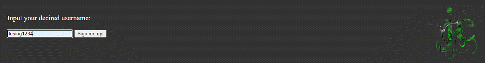

# &lt;jk224jv-input-dialogue&gt;

A web component that represents a text input dialogue.

## Attributes

### `message`

A string attribute, if present, that contains the message to the dialogue.

Default value: Input:

### `buttontext`

A string attribute, if present, that contains the text in the button.

Default value: Send

### `minlength`

A number attribute, if present, that set the minimum allowed lenth of the input.

Default value: 5

### `maxlength`

A number attribute, if present, that set the maximum allowed lenth of the input.

Default value: 32

## Events

| Event Name     | Fired When | event.detail |
|----------------|------------|--------------|
| `inputReceived`| Submit is clicked.| input.value|

## Styling with CSS

the dialogue (div element) is styleable using the part `dialoguebox`.

The text (p element) is styleable using the part `text`.

The submit (input element) is styleable using the part `dialoguebtn`.

The inputfield (input element) is styleable using the part `dialogueinput`.

The errortext (p element) is styleable using the part `errortext`.

## Example

```html
<jk224jv-input-dialogue message="Input your decired username:" buttontext="Sign me up!" minlength="5"></jk224jv-input-dialogue>
```


